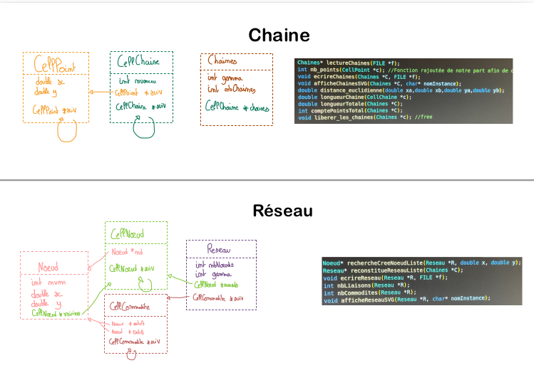
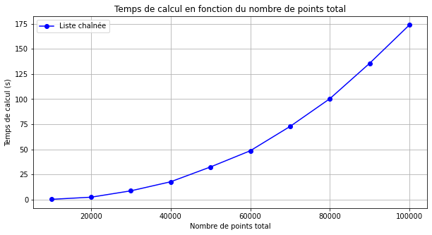
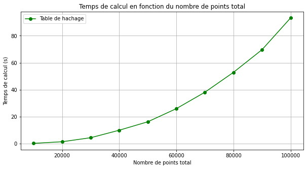
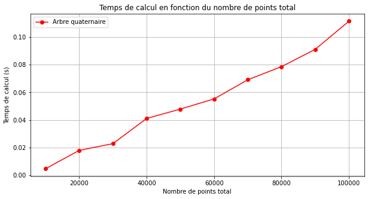

# Projet : Réorganisation d’un réseau de fibres optiques


Nous allons dans un premier temps implémenter différentes stuctures de données afin de gérer un réseau composé de fibre, de commodités et de points.
Dans un second temps nous nous attarderons sur une analyse statistique de ces différentes strucures.  
Le projet se présente sous la forme suivante. Les fichiers compilés sont dans le fichier ```/build/``` qui s'obtient après avoir fait ```make```. Les fichiers ```.h``` sont dans header et les ```.c``` dans src. 

Nous avons, afin d'organiser au mieux le projet, crée ```Resultats/affichage_web/``` et ```Resultats/texte/``` dans lesquelles nous retrouvons les fichier ```.html``` et ```.txt``` générés au fur et à mesure du projet. Dans ce même dossier se trouve un Jupyter-Notebook que nous utilisons pour nos analyses statistiques et nos affichages. 

La commande ```make clean``` permet d'effacer tous les exécutables.
Le tree de notre projet est comme suit:

```
.
├── build
│   ├── ArbreQuat.o
│   ├── ChaineMain.o
│   ├── Chaine.o
│   ├── Chrono.o
│   ├── Generateur.o
│   ├── Graphe.o
│   ├── Hachage.o
│   ├── Reconstitue_Reseau.o
│   ├── Reseau.o
│   ├── Struct_File.o
│   └── SVGwriter.o
├── chaine_main
├── Chrono
├── header
│   ├── ArbreQuat.h
│   ├── Chaine.h
│   ├── Generateur.h
│   ├── Graphe.h
│   ├── Hachage.h
│   ├── Reseau.h
│   ├── Struct_File.h
│   └── SVGwriter.h
├── Makefile
├── README.md
├── reconstitue_Reseau
├── Ressources
│   ├── 00014_burma.cha
│   ├── 00014_burma.res
│   ├── 05000_USA-road-d-NY.cha
│   ├── 05000_USA-road-d-NY.res
│   ├── 07397_pla.cha
│   ├── 07397_pla.res
│   └── enonce.pdf
├── Resultats
│   ├── affichage_web
│   │   ├── test_chaine.html
│   │   ├── test_reseau_arbre.html
│   │   ├── test_reseau_hachage.html
│   │   └── test_reseau_liste.html
│   ├── analyse.ipynb
│   ├── temps_execution.csv
│   └── texte
│       ├── test_arbre.txt
│       ├── test_hachage.txt
│       └── test_liste.txt
└── src
    ├── ArbreQuat.c
    ├── Chaine.c
    ├── ChaineMain.c //Main pour le test des chaînes
    ├── Chrono.c  //Main pour le chronomètre des fonctions
    ├── Generateur.c
    ├── Graphe.c
    ├── Hachage.c
    ├── Reconstitue_Reseau.c //Main test pour toutes nos fonctions
    ├── Reseau.c
    ├── Struct_File.c
    └── SVGwriter.c
```

Les trois grandes structures de données implémentees sont :
- Liste chaînée
- Table de Hachage utilisant les listes châinées pour la résolution des collisions
- Arbre Quaternaire

On retrouve une logique de programmation assez identiques pour toutes les structures avec des fonctions qui reconstitue un ```Reseau``` à partir d'une ```Chaine```.
Voici un schéma qui détaille ces deux structures importantes et les différentes fonctions contenues dans les ```.h``` .


## ANALYSE DES RESULTATS
*Question 4.2* 
On ne rencontre aucune collision avec la fonction qui nous est donnée. Cependant on ne teste que 100 points avec les consignes de l'énoncé et ces points sont des entiers et non des décimaux. Pour avancer cela j'ai réalisé un petit script Python qui vérifie si une valeur a déjà été croisée.


**Question 6.1**
```
Temps d'exécution de reconstitueReseauArbre : 0.026082 secondes
Temps d'exécution de reconstitueReseauListe : 4.177751 secondes
Temps d'exécution de reconstitueReseauHachage avec une taille 1000 : 0.106472 secondes

```
On observe (comme l'on pouvait si attendre) que la liste chaînée est la structure de données la moins efficace. De plus l'arbre semble être la structure la plus adaptée.

**Question 6.4**

Les trois prochains graphiques sont générés grâce à ```matplotlib```(à l'aide du jupyter-notebook). Ils proviennent d'un  ```csv``` qui est généré lui dans ```Chrono.c```. Ces données proviennent de l'analyse du fichier "(Ressources/05000_USA-road-d-NY.cha)". Mais on peut aussi générer avec d'autres jeux de test comme sur "(Ressources/07397_pla.cha)".
  

 

 

L'arbre quaternaire est de loin la meilleure structure de données pour manipuler ce réseau présente une croissance linéaire. Cette structure de données et 1750 fois plus puissance d'un point de vue complexité temporel que la liste chaînée et 874 fois plus puissante que la table de hachage. 
Nous constatons aussi que les deux autres structures de données ont une croissance quadratique. Ce qui était attendu en raison de la croissance en $n^2$ des listes chaînées.

**Question 7.5**
Je n'ai malheureusement pas réussi à me débarasser d'un ```SEGSIV``` je ne peux donc répondre à la question.
